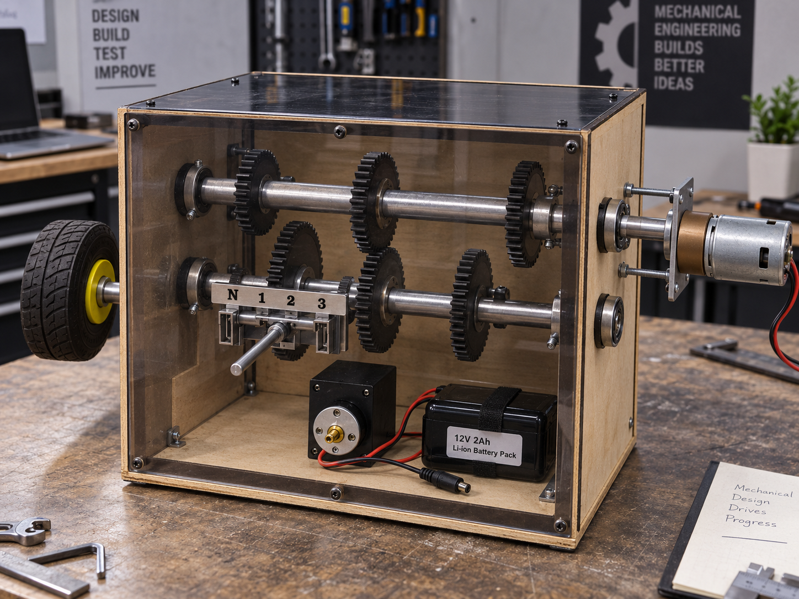
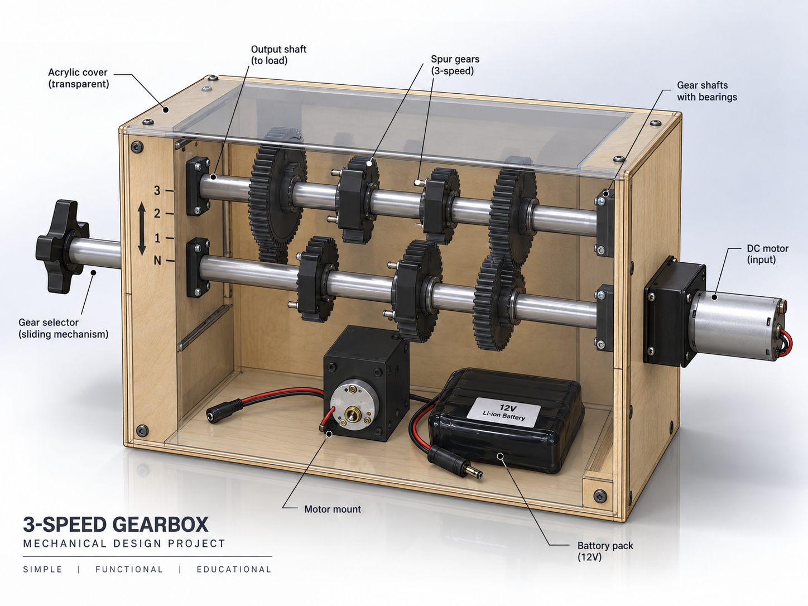
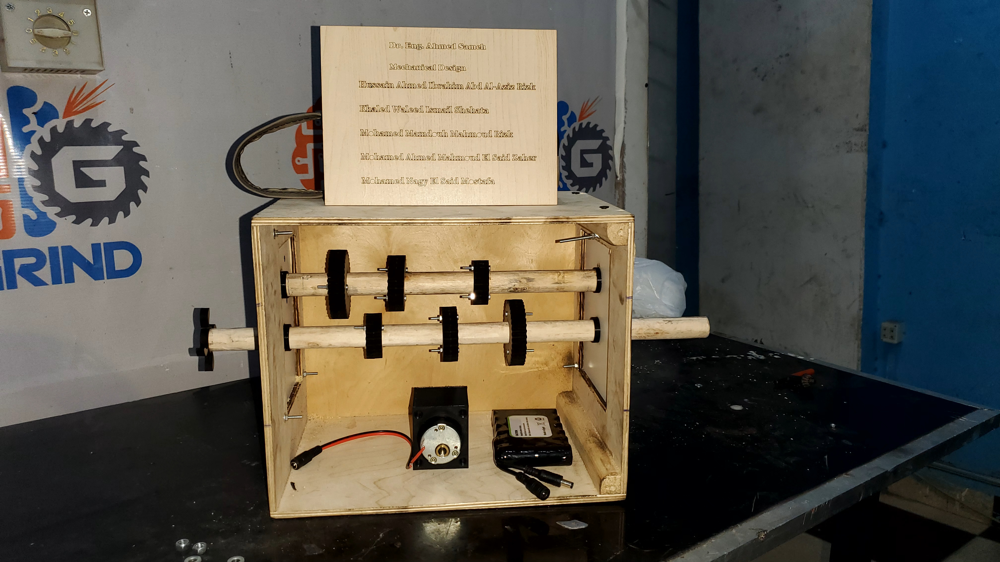

# ⚙️ 3-Speed Gearbox Mechanism

**Mechanical Design — 2023**

A university mechanical-design project demonstrating the working principle of a **3-speed gearbox** using multiple spur gears arranged on two shafts.

The prototype was designed to show how selecting different gear arrangements transfers rotational motion between the shafts and produces different output speeds at the wheel.

---

## 💡 Project Concept

The gearbox uses **gears of different dimensions positioned on two shafts**.  
A **DC motor** provides the rotational input, while a mechanical selector changes the active gear arrangement.

The system has four operating positions:

| Position | Output |
|---|---|
| **N** | Neutral — wheel does not move |
| **1** | First output speed |
| **2** | Faster than Speed 1 |
| **3** | Faster than Speed 2 |

The project was developed using materials including **MDF, mild steel, and acrylic**.

---

## 🔄 How It Works

```text
DC Motor
   ↓
Input / Drive Shaft
   ↓
Selected Gear Pair
   ↓
Second Shaft
   ↓
Output Wheel
```

By changing the selected gear position, a different pair of gears transmits the motor rotation between the two shafts.

---

## 🖼️ Project Visuals

### Realistic Prototype Reconstruction

<p align="center">
  
</p>

### Labeled 3D Mechanical Design

<p align="center">
  
</p>

### Original Unfinished Prototype

<p align="center">
  
</p>

---

## 🔩 Main Mechanical Components

The original project proposal specifies the following main components:

- Gears
- Couplers
- Bearings
- DC motor
- Shafts
- Clamps & mounts
- Wheel
- Base frame
- Supporting frame

### Component Roles

| Component | Purpose |
|---|---|
| **DC Motor** | Provides rotational input to the gearbox |
| **Shafts** | Carry and transmit rotational motion |
| **Gears** | Transfer motion between the two shafts at different ratios |
| **Couplers / Selector** | Allow different gear arrangements to be selected |
| **Bearings** | Support the rotating shafts |
| **Clamps & Mounts** | Hold components in their designed positions |
| **Wheel** | Represents the mechanical output of the gearbox |
| **Base Frame** | Supports the complete prototype |
| **Supporting Frame / Enclosure** | Holds and protects the gearbox assembly |

---

## 🧩 SolidWorks CAD

The gearbox was also modeled using **SolidWorks**.  
The original CAD files are included in this repository.

### Assembly

- [`Assem1.SLDASM`](./SolidWorks/Assem1.SLDASM)

### Part Files

- [`Assem2.SLDPRT`](./SolidWorks/Assem2.SLDPRT)
- [`Box.SLDPRT`](./SolidWorks/Box.SLDPRT)
- [`Gear 1.SLDPRT`](./SolidWorks/Gear%201.SLDPRT)
- [`part1 gear.SLDPRT`](./SolidWorks/part1%20gear.SLDPRT)
- [`part2 gear.SLDPRT`](./SolidWorks/part2%20gear.SLDPRT)
- [`Part3 gear.SLDPRT`](./SolidWorks/Part3%20gear.SLDPRT)
- [`Shaft.SLDPRT`](./SolidWorks/Shaft.SLDPRT)
- [`spur gear_am.SLDPRT`](./SolidWorks/spur%20gear_am.SLDPRT)

These files contain the original CAD work used during the design and development of the gearbox prototype.

---

## 📄 Project Proposal

The original project proposal is included here:

📎 **[View Project Proposal](./Project%20Proposal.pdf)**

The proposal contains the original project idea, operating scenarios, component list, side-view design, and team information.

---

## 📁 Repository Structure

```text
3-Speed-Gearbox-Mechanism/
│
├── README.md
├── Project Proposal.pdf
│
├── Pics/
│   ├── Gearbox_Realistic_Render.png
│   ├── Gearbox_Labeled_Design.png
│   └── Gearbox_Unfinished_Prototype.jpg
│
└── SolidWorks/
    ├── Assem1.SLDASM
    ├── Assem2.SLDPRT
    ├── Box.SLDPRT
    ├── Gear 1.SLDPRT
    ├── part1 gear.SLDPRT
    ├── part2 gear.SLDPRT
    ├── Part3 gear.SLDPRT
    ├── Shaft.SLDPRT
    └── spur gear_am.SLDPRT
```

---

## 🎯 What the Project Demonstrates

- Basic gearbox operation
- Gear-ratio based speed selection
- Rotational-motion transmission
- Shaft and bearing arrangement
- Mechanical selection mechanisms
- Mechanical prototyping and assembly
- SolidWorks part and assembly modeling

---

## 📚 Project Information

**Course:** Mechanical Design  
**Year:** 2023  
**Project:** 3-Speed Gearbox Mechanism  
**Supervisor:** Dr. Eng. Ahmed Sameh

> Educational mechanical prototype designed to demonstrate how different gear arrangements can transfer rotational motion and produce multiple output speeds.
